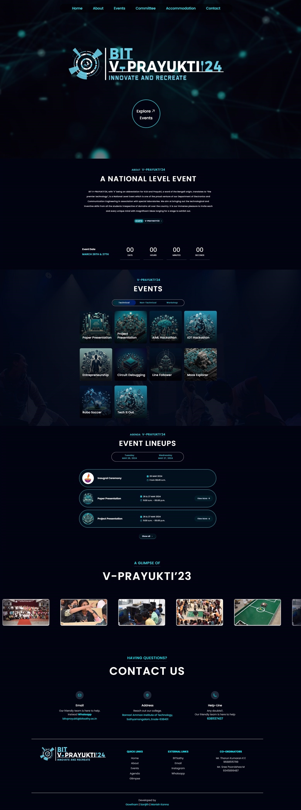

# BIT V-Prayukti (A college event website)

## Project Overview
Experience the buzz of campus events firsthand with Bit-vprayukti! This platform is designed to bring all the excitement of college events to your fingertips. Whether you're looking to explore event schedules, check out venue details, or stay updated on the latest happenings, Bit-vprayukti has got you covered.

---
## Demo

**Website Link** - [Click here](https://bitvprayukti.in/)



---
## Tech Stack

- React
- Redux
- TailwindCSS

---
## Features

- **Event Schedules:** Stay informed about upcoming events with an easy-to-navigate schedule.
- **Venue Details:** Get comprehensive information about event locations and directions.
- **User-Friendly Interface:** Enjoy a seamless browsing experience with our intuitive design.

---
## Stackholders

This website is created for students, faculty, and event organizers at our college, providing a centralized hub for all event-related information.

---
## Run Locally

Clone the project

```bash
  git clone https://github.com/sanjithrk06/Bit-vprayukti.git
```

Go to the project directory

```bash
  cd Bit-vprayukti
```

Install dependencies

```bash
  npm install
```

Start the application

```bash
  npm run start
```

---
*Feel free to reach out through the contact form in [My Portfolio](https://sanjith-portfolio.netlify.app/) or connect with me on social media.
